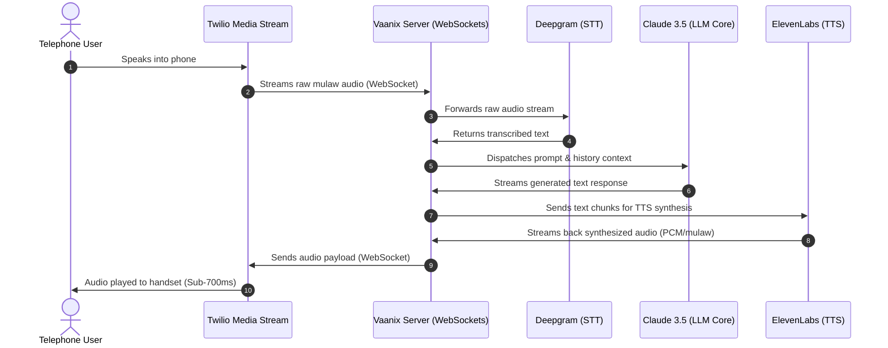

# <p align="center"></p>
# <p align="center">VAANIX</p>
<p align="center">
  <strong>Voice AI Agents, Simplified.</strong>
</p>

<p align="center">
  
  
  
  
  
  
</p>

<p align="center">
  A premium, high-fidelity conversational platform that orchestrates real-time, full-duplex voice interactions. Vaanix connects telephone networks (Twilio) directly with leading AI models (Claude, Deepgram, ElevenLabs) with sub-second latency.
</p>

---

## 🎬 Cinematic Demo & Hero
Vaanix is crafted with premium visual aesthetics, featuring an animated brand mark, dark-mode glassmorphic layouts, and responsive panels designed to feel alive, modern, and technical.

---

## ✨ Key Features

- **⚡ Sub-Second Speech Latency**: Custom WebSocket audio streaming handles voice capture and synthesis, keeping conversation response lags under 700ms.
- **🎙️ ElevenLabs Generative Voices**: Integrate realistic text-to-speech engine profiles, with custom cloning and fine-tuning control.
- **🧠 Full Duplex Agent Flow**: Powered by Deepgram STT, Claude LLM prompt trees, and ElevenLabs TTS to support natural interruptions and conversational context.
- **📊 Developer Console**: Stat-dense workspace displaying active assistants, total calls, minutes consumed, average latency, and real-time active/inactive status.
- **📞 Twilio Telephony Webhooks**: Easily provision virtual phone numbers, manage Twilio Media Streams, and configure outbound dialing webhooks.
- **📁 COLLAPSIBLE LAYOUTS**: Responsive sidebar console collapsing to icon-only on desktops, and transitioning into a touch drawer on mobile screens.

---

## 🏗️ System Architecture

The diagram below outlines how Vaanix routes media streams in real-time between the telephone provider, the server, and the AI engines:



---

## 📂 Repository Structure

```directory
├── .agents/                    # Custom GSD and design guidelines
├── public/                     # Static assets (logo, visual aids)
├── src/
│   ├── components/             # Reusable UI component modules (cards, modals, widgets)
│   ├── integrations/           # Supabase client declarations
│   ├── routes/                 # TanStack filesystem-based routes
│   │   ├── _authenticated/     # Protected console views (assistants, call logs, phone numbers)
│   │   ├── auth.tsx            # Login and onboarding screen
│   │   └── index.tsx           # Premium animated landing page
│   ├── server/                 # Express backend streaming server
│   │   ├── routes/             # Endpoints for outbound calls, voice tokens, and TTS previews
│   │   ├── services/           # Tool execution, system prompt builders, and API configurations
│   │   └── index.ts            # Server entry point, hosting WS connection handlers
│   └── styles.css              # Custom design system styles and animation tokens
├── supabase/                   # Supabase configuration, schema structures, and migrations
├── package.json                # Project dependencies and deployment scripts
└── vite.config.ts              # Vite compiler configuration
```

---

## 🚀 Quick Start

### 📋 Prerequisites
Ensure you have the following installed on your local environment:
- Node.js (v18+)
- npm (v9+)
- Twilio Account (with provisioned phone numbers)
- Supabase project
- ElevenLabs API Account
- Deepgram API Account
- Anthropic API key (for Claude)

---

### ⚙️ Installation

1. **Clone the repository**:
   ```bash
   git clone https://github.com/Atharv1136/campusconnect-ai-assistant.git
   cd campusconnect-ai-assistant
   ```

2. **Install Node dependencies**:
   ```bash
   npm install
   ```

3. **Configure Environment Variables**:
   Create a `.env` file in the root directory and add the following keys. **Do not commit this file to Git.**
   ```env
   # Telephony (Twilio)
   TWILIO_ACCOUNT_SID=your_twilio_sid
   TWILIO_AUTH_TOKEN=your_twilio_auth_token
   TWILIO_NUMBER=your_twilio_phone_number

   # Database (Supabase)
   VITE_SUPABASE_URL=your_supabase_url
   VITE_SUPABASE_ANON_KEY=your_supabase_anon_key
   SUPABASE_SERVICE_ROLE_KEY=your_supabase_service_role_key

   # AI Providers
   DEEPGRAM_API_KEY=your_deepgram_api_key
   ELEVENLABS_API_KEY=your_elevenlabs_api_key
   ANTHROPIC_API_KEY=your_anthropic_api_key

   # Public Server Domain (Tunnel address)
   SERVER_DOMAIN=your_tunnel_address.serveo.net
   ```

---

### 💻 Running Locally

To run the application locally with database connections and WebSocket tunneling:

1. **Launch the backend services**:
   ```bash
   npm run server:run
   ```

2. **Launch the frontend development server**:
   ```bash
   npm run dev
   ```

3. **Expose the local server to Twilio (SSH Tunneling)**:
   Twilio requires a public HTTPS URL to stream calls to your local system. Run the tunnel tool:
   ```bash
   node tunnel.js
   ```
   *Note: This binds your local port `3000` to a public URL (e.g., `https://vaanix.serveo.net`) and auto-registers it with your Twilio webhook settings.*

---

## 🔐 Security & Secrets

> [!WARNING]
> **Never commit your API keys or `.env` files to git.**
> The `.gitignore` has been updated to explicitly ignore all `.env` files. If you add new environment-specific configurations, verify that they are covered under ignored patterns by running `git status`.

---

## 📄 License
This project is licensed under the MIT License - see the [LICENSE](LICENSE) file for details.
