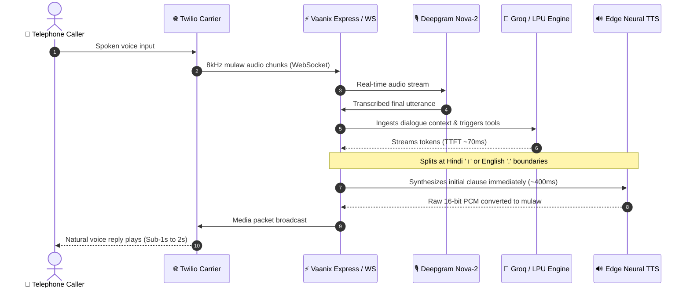

<div align="center">

# 🎙️ VAANIX AI

**Next-Generation, Real-Time Conversational Voice AI Platform**

[](https://www.typescriptlang.org/)
[](https://react.dev/)
[](https://expressjs.com/)
[](https://supabase.com/)
[](https://www.twilio.com/)
[](https://deepgram.com/)
[](https://groq.com/)

<p align="center">
  A high-performance, full-duplex conversational voice infrastructure connecting carrier telephone networks with ultra-fast LLM inference and neural text-to-speech with sub-second response latency.
</p>

</div>

---

## 🌟 Key Capabilities

### ⚡ Sub-Second Conversational Latency
- **Real-Time WebSocket Pipeline**: Bidirectional audio streaming over Twilio Media Streams using 8kHz mulaw encoding.
- **Clause-Level Streaming**: Generates speech audio on the very first clause (`~500ms` TTFA) while LLM tokens and subsequent clauses synthesize concurrently in the background.
- **Multilingual Punctuation Detection**: Native streaming support for English (`.!?`), Hindi/Marathi Devanagari Danda (`।`, `॥`), and conversational pauses.

### 🏢 Multi-Tenant Enterprise Isolation
- **Row-Level Security (RLS)**: Organizations and users have fully isolated workspaces. Users can only access their own assistants, contacts, call records, and analytics.
- **Custom BYOK Key Pool**: Users can configure their own AI provider keys (Groq, Gemini, OpenAI, Anthropic, Together) with automated failover and priority routing.

### 🎯 Generalized Domain Templates
Out-of-the-box business agent configurations with tailored system prompts and tools:
- **Salon & Spa** (e.g. Lakme Salon): Stylist assignment, appointment booking, rescheduling, and cancellation.
- **Healthcare & Clinics**: Patient intake, doctor scheduling, prescription refill requests.
- **Education & Admissions**: Campus tours, tuition inquiries, application status.
- **Customer Support**: Ticket escalation, account inquiries, call transfers.

### 🧠 Full-Duplex Speech & Barge-In
- **Deepgram Nova-2 Integration**: Continuous speech recognition with intelligent utterance accumulation.
- **Smart Acoustic Echo Guard**: Prevents speakerphone feedback from self-interrupting the agent while permitting genuine human interruptions.

---

## 🏗️ System Architecture


```mermaid
sequenceDiagram
    autonumber
    actor Caller as 📱 Telephone Caller
    participant Twilio as 🌐 Twilio Carrier
    participant Server as ⚡ Vaanix Express / WS
    participant STT as 🎙️ Deepgram Nova-2
    participant LLM as 🧠 Groq / LPU Engine
    participant TTS as 🔊 Edge Neural TTS

    Caller->>Twilio: Spoken voice input
    Twilio->>Server: 8kHz mulaw audio chunks (WebSocket)
    Server->>STT: Real-time audio stream
    STT->>Server: Transcribed final utterance
    Server->>LLM: Ingests dialogue context & triggers tools
    LLM-->>Server: Streams tokens (TTFT ~70ms)
    Note over Server,TTS: Splits at Hindi '।' or English '.' boundaries
    Server->>TTS: Synthesizes initial clause immediately (~400ms)
    TTS-->>Server: Raw 16-bit PCM converted to mulaw
    Server->>Twilio: Media packet broadcast
    Twilio-->>Caller: Natural voice reply plays (Sub-1s to 2s)
```

---

## 📂 Repository Structure

```
├── .agents/                    # Custom skills and design tokens
├── public/                     # Static assets and brand imagery
├── scripts/
│   └── tunnel.cjs              # Auto-reconnecting IPv4 tunnel daemon
├── src/
│   ├── components/             # Reusable UI component modules (cards, modals, widgets)
│   ├── lib/
│   │   ├── api.ts              # Authenticated client-side API layer
│   │   └── domainPacks.ts      # Multi-industry business presets
│   ├── routes/                 # TanStack filesystem-based routes
│   │   ├── _authenticated/     # Protected console views (assistants, analytics, logs)
│   │   ├── auth.tsx            # Login and user registration
│   │   └── index.tsx           # Modern dark-mode landing page
│   └── server/                 # Express backend streaming server
│       ├── actions/            # Dynamic tool handlers (booking, cancellation)
│       ├── mediaStream/        # Real-time WebSocket audio handler
│       ├── services/           # Groq key pool, tool executor, scheduled jobs
│       ├── deepgram.ts         # Speech recognition client
│       ├── edgeTts.ts          # Free high-quality neural voice synthesizer
│       └── index.ts            # Telephony server entry point
├── supabase/                   # Schema migrations & multi-tenant security
└── memory.md                   # Complete architectural evolution & incident memory
```

---

## 🚀 Quick Start

### Prerequisites
- **Node.js**: v18+ 
- **Twilio Account**: Phone number with voice capabilities
- **Supabase Project**: With database migrations applied
- **Deepgram API Key**: For speech-to-text
- **Groq API Key**: For ultra-fast LLM inference

### Installation

1. **Clone the repository**:
   ```bash
   git clone https://github.com/Atharv1136/campusconnect-ai-assistant.git
   cd campusconnect-ai-assistant
   ```

2. **Install dependencies**:
   ```bash
   npm install
   ```

3. **Configure Environment Variables**:
   Create a `.env` file in the project root:
   ```env
   # Twilio Telephony
   TWILIO_ACCOUNT_SID=AC...
   TWILIO_AUTH_TOKEN=...
   TWILIO_PHONE_NUMBER=+1...

   # Database (Supabase)
   VITE_SUPABASE_URL=https://your-project.supabase.co
   VITE_SUPABASE_ANON_KEY=eyJ...
   SUPABASE_SERVICE_ROLE_KEY=eyJ...

   # Speech & AI Providers
   DEEPGRAM_API_KEY=...
   GROQ_API_KEY=gsk_...
   PORT=3000
   ```

4. **Start the Telephony Server & Tunnel**:
   ```bash
   # Terminal 1: Run Express Server
   npm run server:run

   # Terminal 2: Run Auto-reconnecting Tunnel
   node scripts/tunnel.cjs

   # Terminal 3: Run Frontend Web Console
   npm run dev
   ```

---

## 📄 License

This project is licensed under the MIT License — see the [LICENSE](LICENSE) file for details.
