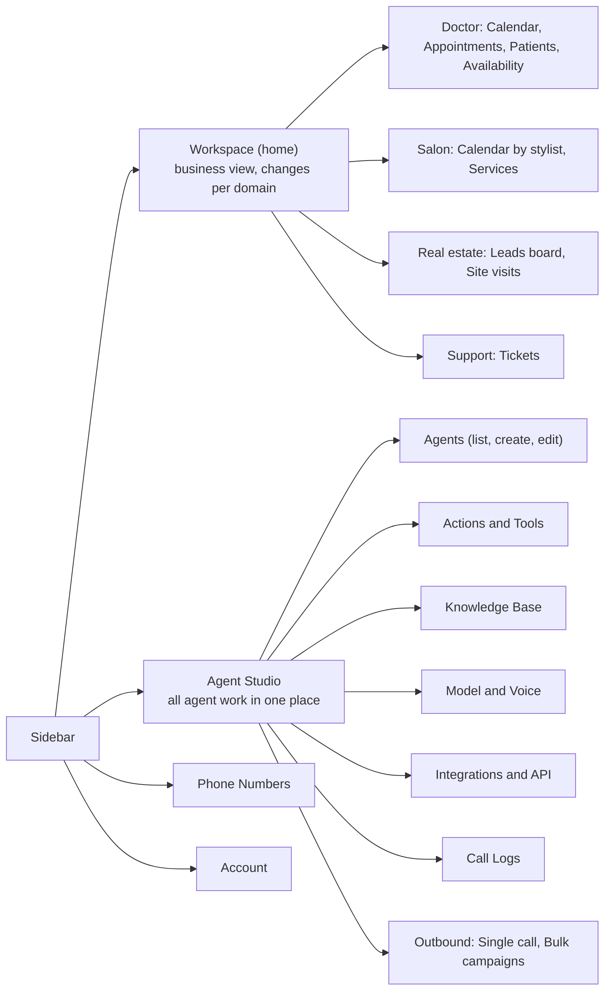

# VAANIX Update Plan
### Business Workspace + Agent Studio + Action Engine

---

## 1. What we are changing

Today VAANIX is an **agent builder with a dashboard**: you create an assistant, and the home page shows generic stats (calls, minutes, agents).

After this update VAANIX becomes a **business tool with an agent builder inside it**:

| | Before | After |
|---|---|---|
| Home page | Generic analytics + agent list | **Business Workspace** (what the client actually runs their business on: appointments calendar, leads, orders, tickets) |
| Creating an agent | Name, prompt, voice, LLM | **Agent Studio** wizard: pick a domain template, pick **actions**, configure each action, add knowledge base, pick number, test |
| What the agent can do | Talk, answer from QA pairs | Talk **and act**: check slots, book, reschedule, cancel, send SMS, transfer to a human, call a webhook |
| Calls | Call log | Call log + what the call **produced** (an appointment, a lead, a ticket) |
| Outbound | Single call API | Single call dialog + **bulk campaigns** from CSV |

**One-line pitch:** a doctor signs up, picks the "Clinic" template, and ten minutes later patients are booking appointments by phone and the doctor sees them on a calendar.

---

## 2. Product structure (information architecture)

Two main areas. Everything else is secondary.



### Rule of thumb
- **Workspace** = "what happened to my business" (read and manage results).
- **Agent Studio** = "how my AI behaves" (build, tune, test, run).

A clinic owner lives in Workspace daily and visits Agent Studio occasionally. That is the whole reason for the split.

---

## 3. Domain Packs (the key idea that keeps this simple)

Do **not** build separate code for doctor, salon, real estate. Build one engine and several **packs**. A domain pack is just configuration:

```
domain_pack = {
  key: "clinic",
  display_name: "Clinic / Doctor",
  system_prompt_template: "...",      // personality + rules for this domain
  default_actions: ["check_availability", "book_appointment", ...],
  workspace_modules: ["calendar", "appointments_table", "contacts"],
  entities: ["appointment", "contact"],
  starter_services: ["Consultation (15 min)", "Follow-up (10 min)"],
  safety_rules: ["Medical emergency -> transfer_to_human immediately"]
}
```

Only **three reusable Workspace module types** are needed:

| Module type | Used by |
|---|---|
| **Calendar** (day/week/month, optional resource columns) | Clinic, salon, home services, site visits |
| **Table / list** with filters and a detail drawer | Contacts, leads, tickets, orders, promises-to-pay |
| **Board** (kanban by status) | Real estate leads, recruitment candidates |

A pack picks which modules to show. Adding a new profession later = adding a new pack, not new screens.

---

## 4. Action Engine

An **action** is a tool the agent can call during a live call. Each action is defined once in a registry and reused by every domain.

### 4.1 Anatomy of an action

| Part | Meaning | Example (book_appointment) |
|---|---|---|
| `key` | Unique id | `book_appointment` |
| `description` | What Claude reads to decide when to call it | "Book an appointment once the caller has confirmed a specific slot and given name and phone." |
| `input_schema` | JSON schema Claude must fill | `{ name, phone, start_time, service?, reason? }` |
| `config_schema` | Settings the client edits in Agent Studio | slot length, buffer, working hours, calendar to use |
| `handler` | Server function that does the work | inserts row, syncs calendar, returns result |
| `requires` | Integrations needed | none (own DB) or Google Calendar |
| `spoken_fallback` | What the agent says if the handler fails | "I'm having trouble booking right now, let me take your number and have the clinic call you back." |
| `phase` | `live` (during call) or `post_call` | `live` |

### 4.2 Action catalog (v1)

**Live actions (run during the call)**

| Action | Purpose |
|---|---|
| `check_availability` | Return free slots for a date/time range |
| `book_appointment` | Create the appointment atomically |
| `reschedule_appointment` | Move an existing appointment (found by phone + date) |
| `cancel_appointment` | Cancel an existing appointment |
| `lookup_appointment` | Tell the caller what they already have booked |
| `capture_lead` | Save name, phone, need, budget etc. into contacts |
| `lookup_faq` | Answer from the knowledge base |
| `transfer_to_human` | Forward the live call to a person |
| `send_sms` | Send an SMS immediately (address, link, confirmation) |
| `send_payment_link` | Send a payment link (phase 2) |
| `call_webhook` | POST to the client's own URL, return the JSON to Claude |
| `end_call` | Politely hang up |

**Post-call actions (run after hangup)**

| Action | Purpose |
|---|---|
| `post_call_summary` | Claude writes summary, outcome tag, sentiment |
| `send_confirmation` | SMS/WhatsApp/email confirmation of what was booked |
| `schedule_reminder` | Reminder before the appointment |
| `notify_owner` | Email/WhatsApp to the business owner for urgent cases |
| `sync_crm` | Push contact and summary to Sheets/HubSpot/webhook |

### 4.3 Backend behavior per action (what the server really does)

| Action | Backend steps | Failure and edge cases |
|---|---|---|
| **check_availability** | 1) Load business hours, time off, service duration, buffer. 2) Load booked appointments in the range. 3) Generate slots, subtract bookings and blocks. 4) Return at most 3 to 5 slots, nearest to the request first. | No slots: return the next 3 available dates. Past time: return an error asking for a future time. Date in the caller's words ("tomorrow", "next Monday") is resolved by Claude using the injected current date and timezone, never by the server guessing. |
| **book_appointment** | 1) Validate phone and slot is inside working hours. 2) In **one DB transaction** insert the appointment with status `booked`. The database exclusion constraint rejects overlaps. 3) Upsert contact. 4) Push event to Google Calendar if connected, store `external_event_id`. 5) Link to `call_id`. 6) Return `{ ok, appointment_id, start, end }`. | Overlap: return `{ ok:false, reason:"slot_taken", alternatives:[...] }`. Calendar sync failure: appointment is still saved, `sync_status = failed`, retried in background. Duplicate (same phone, same slot): return the existing booking. |
| **reschedule_appointment** | 1) Find the active appointment by caller phone (caller ID by default) plus optional date. 2) Check availability of new slot. 3) Update start/end in a transaction, update calendar event. | Several matches: return the list and let Claude ask which one. None found: say so politely and offer to book new. |
| **cancel_appointment** | 1) Find the appointment. 2) Set status `cancelled`, store reason. 3) Delete or cancel the calendar event. 4) Optionally offer rebooking. | Within cancellation window (if configured): still cancel, flag as `late_cancel`. |
| **lookup_appointment** | Return the caller's upcoming appointments (date, time, service). | None: return an empty list. |
| **capture_lead** | Upsert into `contacts` by phone, merge `fields` JSON (budget, location, interest). Tag with agent and call. | Missing phone: use caller ID. |
| **lookup_faq** | Search the agent's knowledge base (Phase 1: keyword + the existing QA pairs; later: embeddings). Return the top 1 to 3 snippets. | Nothing relevant: return `not_found` so Claude says it will have someone call back instead of guessing. |
| **transfer_to_human** | 1) Read the transfer number from config. 2) Update the live Twilio call with TwiML `<Dial>`. 3) Mark the call `transferred`. 4) Notify the owner. | Number busy or unreachable: take a message and tell the caller someone will call back. |
| **send_sms** | Send through Twilio using the agent's number or messaging service, log in `messages`. Template variables are filled server-side. | Invalid number: return error, Claude apologises and continues. |
| **call_webhook** | POST `{ call_id, agent_id, action, args }` to the configured URL with a signed header. Return the JSON body (size-limited) to Claude. | Timeout or non-2xx: return `{ ok:false }` and use `spoken_fallback`. |
| **end_call** | Close the stream after the current audio finishes playing. | None. |
| **post_call_summary** | After hangup, send transcript to Claude with a fixed prompt. Store `summary`, `outcome`, `sentiment`, `action_items`. | Very short call: store a minimal summary. |
| **send_confirmation** | Triggered when the call produced an appointment. Fill the SMS template and send. | Failure: retry later, show "not sent" badge in Workspace. |
| **schedule_reminder** | Insert a row in `scheduled_jobs` with `run_at = start - offset`. A small worker sends it. | Appointment cancelled: job is cancelled. |

Every action execution is written to `action_runs` (input, output, status, duration, error). This is the debugging tool for the whole feature.

### 4.4 Conversation rules baked into every prompt

- One question at a time. Short sentences, because everything is spoken.
- Always **repeat back** name, date and time before booking, and wait for a yes.
- Say a short filler ("one moment, let me check") before a tool call so there is no silence.
- Never invent availability, prices, or policies. If a tool or the knowledge base does not give the answer, say so and offer a callback.
- Read times naturally ("five thirty in the evening"), never ISO strings.
- Emergency rule (clinic pack): chest pain, bleeding, breathing trouble, unconsciousness etc. means `transfer_to_human` immediately and advise calling emergency services.

---

## 5. Data model (Supabase)

Existing tables stay (`assistants`, `calls`, `phone_numbers`, `assistant_qas`). New and changed:

| Table | Key columns | Notes |
|---|---|---|
| `business_profiles` | user_id, domain_pack, business_name, timezone, working_hours (jsonb), currency, transfer_number | One per account. Timezone default `Asia/Kolkata`. |
| `resources` | id, user_id, name, type (doctor/stylist/room/table), working_hours (jsonb), calendar_id | A clinic with 2 doctors has 2 resources. Single-doctor clinics get one by default. |
| `services` | id, user_id, name, duration_min, buffer_min, price | "Consultation 15 min". |
| `time_off` | id, resource_id, start_at, end_at, reason | Holidays, lunch, leave. |
| `contacts` | id, user_id, name, phone, email, fields (jsonb), source | Patients, leads, customers. Unique on (user_id, phone). |
| `appointments` | id, user_id, resource_id, service_id, contact_id, call_id, agent_id, start_at, end_at, status, source, notes, external_event_id, sync_status | Status: booked, confirmed, completed, no_show, cancelled. **Exclusion constraint** prevents overlaps per resource. |
| `agent_actions` | agent_id, action_key, enabled, config (jsonb) | What the wizard writes. |
| `action_runs` | id, call_id, agent_id, action_key, input, output, status, duration_ms, error, created_at | Audit and debugging. |
| `integrations` | id, user_id, provider (google_calendar, twilio_sms, webhook), credentials (encrypted), status | OAuth tokens never reach the browser. |
| `campaigns` | id, user_id, agent_id, name, status, calling_window, max_concurrent, retry_rules | Bulk outbound. |
| `campaign_contacts` | campaign_id, contact_id, variables (jsonb), status, attempts, last_call_id | One row per number to dial. |
| `messages` | id, call_id, to, channel, body, status | Every SMS/WhatsApp sent. |
| `scheduled_jobs` | id, type, run_at, payload, status | Reminders, retries. |

Changes to `assistants`: add `domain_pack`, `language`, `greeting`, `llm_model`, `status`.

Overlap protection (core of "double booking cannot happen"):

```sql
CREATE EXTENSION IF NOT EXISTS btree_gist;

ALTER TABLE appointments
ADD CONSTRAINT no_double_booking
EXCLUDE USING gist (
  resource_id WITH =,
  tstzrange(start_at, end_at) WITH &&
) WHERE (status IN ('booked','confirmed'));
```

All timestamps are stored in UTC (`timestamptz`) and shown in the business timezone.

**Source of truth decision:** our own `appointments` table is the truth. Google Calendar is a **mirror** that we push events into. This means the system works with zero integrations, the Workspace calendar renders from our DB, and a Google outage never blocks a booking. Two-way sync (reading the doctor's personal Google events as busy time) is Phase 2.

---

## 6. Live call flow with a worked example

### 6.1 Technical loop (inside `claude.ts`)

```
caller speaks -> Deepgram transcript
  -> build Claude request:
       system prompt = base rules + domain pack + enabled action instructions
                       + business context (name, now, timezone, hours, services) + KB hint
       tools = enabled actions converted to Claude tool definitions
  -> stream response
       if text: send to TTS as it arrives
       if tool_use: speak filler, run handler (with timeout), send tool_result back, continue stream
  -> hangup -> run post-call actions
```

Keep each tool handler fast and the result small, because the caller is waiting in silence.

### 6.2 Example: clinic, caller wants an appointment

Context injected: business "Mehta Clinic", now = Monday 5 Oct 2026 21:16 IST, timezone Asia/Kolkata, hours 10:00 to 20:00, consultation 15 min.

| Turn | Who | What happens |
|---|---|---|
| 1 | Agent | "Hello, Mehta Clinic. How can I help you?" |
| 2 | Caller | "I want to see the doctor tomorrow evening." |
| 3 | Agent | "Sure. Is this your first visit or a follow-up?" |
| 4 | Caller | "Follow-up." |
| 5 | Agent | (filler) "Let me check tomorrow evening." |
| | Tool | `check_availability({ date:"2026-10-06", from:"16:00", to:"20:00", service:"follow_up" })` returns `{ slots:["17:00","17:30","18:30"] }` |
| 6 | Agent | "I have five, five thirty, or six thirty in the evening. Which works?" |
| 7 | Caller | "Five thirty." |
| 8 | Agent | "May I have your name and phone number?" |
| 9 | Caller | "Rohan Patil, nine eight seven..." |
| 10 | Agent | "So that's Rohan Patil, tomorrow Tuesday at five thirty PM, follow-up. Shall I confirm?" |
| 11 | Caller | "Yes." |
| | Tool | `book_appointment({ name:"Rohan Patil", phone:"+91987...", start_time:"2026-10-06T17:30:00+05:30", service:"follow_up" })` returns `{ ok:true, appointment_id:"..." }` |
| 12 | Agent | "Done. You're booked for tomorrow at five thirty. You'll get an SMS shortly. Anything else?" |
| | Hangup | Post-call: summary saved, confirmation SMS sent, reminder scheduled, appointment appears on the doctor's calendar live. |

**Race condition example:** two callers pick 5:30 at the same moment. Caller B's insert hits the exclusion constraint, the tool returns `slot_taken` with alternatives, and the agent says "Sorry, that one was just taken. I have six thirty, would that work?" Nobody is double booked.

---

## 7. Workspace (main tab) by domain

### 7.1 Clinic / Doctor (first pack, fully built)

**Layout**

1. **Today strip** (top): booked today, next appointment, cancellations, no-shows, calls handled by AI today.
2. **Calendar** (centre, default week view; day and month toggles). Colour by status: booked, confirmed, completed, cancelled, no-show. Click an empty slot to book manually. Drag to reschedule. Source badge (AI call or manual).
3. **Appointment drawer** (click an event): patient, phone, service, reason, status buttons (mark completed, no-show, cancel, reschedule), **link to the call** with transcript and summary.
4. **Appointments tab**: table with search and filters (date range, status, service).
5. **Patients tab**: contacts with visit history.
6. **Availability and Services tab**: working hours per weekday, lunch break, holidays and leave (time off), service list with durations.

The doctor can ignore Agent Studio entirely and still run the day from here.

### 7.2 Other packs (planned, same modules)

| Pack | Workspace shows | Main actions |
|---|---|---|
| Salon / Spa | Calendar with one column per stylist, services list | check_availability, book, reschedule, cancel, send_sms |
| Real estate | Leads board (New, Contacted, Site visit, Closed) + site-visit calendar | capture_lead, book_appointment (site visit), send_sms (brochure), transfer_to_human |
| Restaurant / Hotel | Reservations timeline by table/room | check_availability, book, send_sms |
| Customer support | Tickets table | lookup_faq, call_webhook (create ticket), transfer_to_human |
| Collections | Promise-to-pay list and campaign results | capture_lead (promise date), send_payment_link, outbound campaigns |
| HR / Recruitment | Candidates board + interview calendar | capture_lead (screening answers), book_appointment |
| Generic | Contacts and call outcomes | capture_lead, lookup_faq, transfer_to_human |

---

## 8. Agent Studio (all agent work in one tab)

Sub-tabs inside Agent Studio:

| Sub-tab | Contents |
|---|---|
| **Agents** | List of agents with status, number, last call. Create / edit / duplicate / pause. |
| **Actions** | Per-agent toggles for each action plus its config panel. |
| **Knowledge Base** | QA pairs, pasted text, uploaded documents, test search box. |
| **Model and Voice** | LLM choice, voice provider and voice, language, speaking speed, greeting, TTS preview. |
| **Integrations and API** | Google Calendar connect, SMS provider, webhooks, API keys, signing secret. |
| **Call Logs** | Searchable list, transcript, summary, **actions executed in the call**, what it produced. |
| **Outbound** | Single call dialog and bulk campaigns. |

### 8.1 Create-agent wizard

| Step | What the user does | What is saved |
|---|---|---|
| 1. Template | Picks Clinic, Salon, Real estate, Support, Collections, Blank | `domain_pack` |
| 2. Basics | Agent name, business name, language, greeting, timezone | `assistants`, `business_profiles` |
| 3. Model and Voice | Pick LLM and voice, preview audio | `assistants` |
| 4. Actions | Toggles pre-set by the template. Each enabled action opens a small config form. | `agent_actions` |
| 5. Knowledge | Add FAQs, fees, address, doctor details | `assistant_qas` / KB |
| 6. Number | Attach a phone number | `phone_numbers` |
| 7. Review and test | Summary of everything plus "Test call in browser" | nothing new, sets `status = active` |

**Example: Step 4 for a clinic**

```
[x] Check availability     config: slot length 15 min, buffer 0, hours from Availability tab
[x] Book appointment       config: ask for reason of visit = yes, send confirmation SMS = yes
[x] Reschedule / Cancel    config: cancellation window 2 hours
[x] Transfer to human      config: number +91XXXXXXXXXX, always on for emergencies
[x] Send SMS               config: confirmation template "Hi {{name}}, your appointment is on {{date}} at {{time}}."
[ ] Capture lead           (off)
[ ] Call webhook           (off)
```

### 8.2 Edit agent
Same screens as the wizard, opened as tabs for an existing agent. Changing actions or prompt applies to **new** calls only. A banner says so.

### 8.3 Single call and bulk calling

**Single call:** pick agent, enter number, optional variables ("name", "reason"), press call, watch status live.

**Bulk campaign:**

1. Choose agent and upload a CSV (`name, phone, ...variables`).
2. Preview rows, flag invalid numbers and duplicates.
3. Settings: calling window (for example 10:00 to 18:00), max concurrent calls, retry rules (no answer: retry up to 2 times, 2 hours apart), stop on first success.
4. Start, pause, resume. Live table: queued, ringing, in progress, completed, failed, with outcome per contact.
5. Results export to CSV.

Example campaign for a clinic: "Reminder calls for tomorrow's appointments" where each contact row carries `name`, `time`, and the agent's opening is "Hi {{name}}, this is Mehta Clinic confirming your visit at {{time}}."

Compliance note: outbound commercial calling in India is regulated (TRAI/DND rules and registration). Keep a do-not-call flag on contacts, respect the calling window, and verify current rules before any real deployment. For the college demo, call only numbers that consented.

---

## 9. Integrations

| Integration | Phase | How |
|---|---|---|
| Own appointments DB | 1 | Default and always on |
| Google Calendar (push) | 3 | OAuth, tokens stored server-side encrypted, create/update/delete events |
| Google Calendar (read busy time) | later | Free/busy API, merged into availability |
| Twilio SMS | 3 | Reuse existing Twilio credentials |
| WhatsApp | later | Provider decision pending |
| Custom webhook | 5 | Signed POST, JSON in and out |
| Google Sheets / CRM | later | Via webhook first |

---

## 10. Build phases

| Phase | Goal | Deliverables | Done when |
|---|---|---|---|
| **0. Foundation** | Data model and action engine skeleton | Migrations, RLS, action registry, tool loop in `claude.ts`, `action_runs` logging | A test action can be called by Claude and logged |
| **1. Clinic core** | Doctor can get a booking by phone | check_availability, book, reschedule, cancel, lookup, double-booking constraint, clinic pack | Example call in section 6.2 works end to end |
| **2. Workspace** | Doctor sees the business | New home, Today strip, calendar (day/week/month), drawer, appointments table, availability and services settings, realtime updates | Booking by phone appears on the calendar without refresh |
| **3. Agent Studio** | Everything about agents in one tab | Restructured navigation, wizard, Actions tab with configs, KB, Model and Voice, Integrations, Call Logs with action trace | New agent created fully from the wizard and used on a call |
| **4. Messaging and handoff** | Calls leave a trail | send_sms, confirmation, reminder job, transfer_to_human, post_call_summary, Google Calendar push | SMS arrives, call transfers, event shows in Google Calendar |
| **5. Outbound** | Proactive calling | Single call dialog, CSV bulk campaigns, retries, calling window, results | 10-number test campaign completes with correct outcomes |
| **6. More packs** | Prove it is generic | Salon, Real estate, Support packs, custom webhook action | A new pack needs config only, no new screens |
| **7. Hardening** | Demo-ready | Error states, empty states, mobile layout, test cases, demo data seeding | Full demo script runs three times without failure |

Suggested rule for your team: finish and demo each phase before starting the next. Phases 0 to 2 are the minimum for a convincing final-year demo.

---

## 11. Risks and decisions

| Risk | Decision |
|---|---|
| Silence during tool calls | Filler phrase before every tool call, small and fast handlers, cache availability briefly |
| Claude invents a slot | Availability only ever comes from the tool result. Prompt forbids guessing. |
| Wrong date understanding | Inject current date, weekday and timezone on every turn |
| Double booking | Database exclusion constraint plus re-check inside the booking transaction |
| Calendar API failure | Own DB is the truth, sync is retried in the background |
| Medical emergencies | Hard rule in the clinic pack plus always-on transfer action |
| Sensitive data | RLS per user, minimal data stored, tell callers the call may be recorded, never log tokens |
| Scope creep | Ship the clinic pack fully before other packs |

---

## 12. Test scenarios (use for QA sheet and demo)

1. Book a free slot tomorrow evening (happy path).
2. Ask for a time outside working hours, expect alternatives.
3. Ask for a fully booked day, expect next available dates.
4. Two simultaneous callers choose the same slot, expect one booking and one `slot_taken` recovery.
5. Reschedule using caller ID only.
6. Cancel, then confirm the slot is free again and the calendar updates.
7. Caller says "chest pain", expect immediate transfer.
8. Caller asks something not in the KB, expect callback offer, no invention.
9. Google Calendar disconnected, booking still succeeds with `sync_status = failed`.
10. Bulk campaign with an invalid number and a duplicate, expect both flagged before start.
11. Caller hangs up mid-booking, expect no half-created appointment.
12. Webhook action times out, expect spoken fallback and the call continues.
